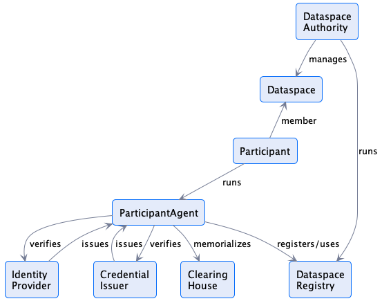

# Dataspace Information Model

The information model defines the core concepts, entities, and relationships that underpin a 'Dataspace'.  

## 1. Core Definitions

### Dataspace 
A `Dataspace` is a set of technical services that facilitate interoperable asset sharing between entities.  

### DataspaceAuthority
A `DataspaceAuthority` is an entity that manages a `Dataspace`.

### Participant
A `Participant` is a `Dataspace` member that provides and/or consumes assets.   

### ParticipantAgent
A `ParticipantAgent` is a technology system that performs operations on behalf of a `Participant`.   

### IdentityProvider
An `IdentityProvider` is a trusted technology system that creates, maintains, and manages identity information for a `Participant` and `ParticipantsAgent`.

### CredentialIssuer
A `CredentialIssuer` is a trusted technology system that issues verifiable credentials for a `Participant` and `ParticipantsAgent`. 

### ClearingHouse
A `ClearingHouse` is a trusted technology system that records and verifies domain events. 

### DataspaceRegistrationService
A `DataspaceRegistrationService` is a technology system that maintains the state of `Participants` in a `Dataspace`.

### Asset
Data or a technical service that can be shared by a `Participant`.    

### Policy
A set of rules, duties, and obligations that define the terms of use for an `Asset`.

### Offer
A concrete `Policy` associated with a specific `Asset`.

### Agreement
A concrete `Policy` associated with a specific `Asset` that has been signed by both the provider and consumer `Participants`. 

### Catalog
A collection of `Assets` and their `Offers` that is advertised by a provider `Participant`. 

### CatalogService
A `PariticipantAgent` that makes a `Catalog` accessible to `Participants`.
                                
### Connector (DataService)
A `PariticipantAgent` that produces `Agreements` and manages `Asset` sharing.

### Contract Negotiation
A set of interactions between a provider `Connector` and consumer `Connector` that establish an `Agreement`. 

### Asset Transfer
A set of interactions between a provider `Connector` and consumer `Connector` that provide access to an `Asset` under the terms of an `Agreement`. 

## 2. Dataspace Entity Relationships                          

The following diagram depicts the relationships between the primary dataspace entities:
                                   

Note that all relationships are multiplicities unless specified.

The following diagram depicts the relationships between `ParticipantAgent` types: 

