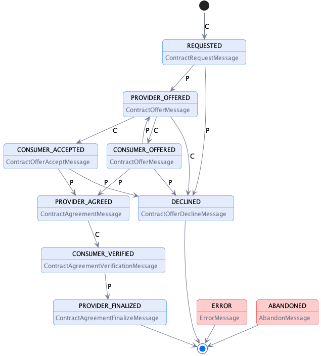

# Contract Negotiation Protocol
                                                                                                                                                              
## Introduction: Terms

This document outlines the key elements of the contract negotiation protocol. The following terms are used: 

- A _**message type**_ defines the structure of a _message_.
- A _**message**_  is an instantiation of a _message type_. 
- The _**contract negotiation protocol**_ is the set of allowable message type sequences and is defined as a state machine (CNP-SM).
- A _**contract negotiation (CN)**_ is an instantiation of the CNP-SM.
- A _**provider**_ is a participant agent that offers an asset.
- A _**consumer**_ is a participant agent that requests access to an offered asset. 
 
## Contract Negotiation Protocol

A contract negotiation (CN) involves two parties, a _provider_ that offers one or more assets under a usage policy and _consumer_ that requests assets. A CN progresses through 
a series of states, which are tracked by the provider and consumer using messages. A CN transitions to a state in response to a message from the counter-party. 

The CN states are: 

- **REQUESTED** - A contract for an asset has been requested by the consumer and the provider has sent an ACK response.
- **PROVIDER_OFFERED** - The provider has sent a contract offer to the consumer and the consumer has sent an ACK response. 
- **CONSUMER_OFFERED** - The consumer has sent a contract offer to the provider and the provider has sent an ACK response. 
- **CONSUMER_ACCEPTED** - The consumer has accepted that latest contract offer and the provider has sent an ACK response. 
- **PROVIDER_AGREED** - The provider has accepted that latest contract offer, sent an agreement to the consumer, and the consumer has sent an ACK response.
- **CONSUMER_VERIFIED** - The consumer has sent an agreement verification to the provider and the provider has sent an ACK response.
- **PROVIDER_FINALIZED** - The provider has sent a finalization message to the consumer and the provider has sent an ACK response. Data is now available to the consumer.
- **DECLINED** - The provider or consumer has declined the contract negotiation. This is a final state.
- **ERROR** - The provider or consumer has placed the contract negotiation in an error state. This is a final state.
- **ABANDONED** - The provider or consumer has placed the contract negotiation in an abandoned state. This is a final state.

### Contract Negotiation State Machine

The CN state machine is represented in the following diagram. Note that transitions to the ERROR or ABANDONED states may occur from any other state and are not shown for simplicty:

 

## Message Types

The CN state machine is transitioned upon receipt and acknowledgement of a message. This section details those messages as abstract message types. Concrete wire formats are 
defined by the protocol binding, e.g. HTTPS. 

### ContractRequestMessage
**Sent by**: Consumer

**Resulting State**: REQUESTED

**Example**: (xx)[]

**Schema**: (xx)[]

#### Description

The _ContractRequestMessage_ is sent by a consumer to initiate a contract negotiation.  

- **ContractRequestMessage** - Sent by the consumer.
- **ContractOfferMessage** - Sent by the consumer or provider.
- **ContractOfferAcceptMessage** - Sent by the consumer.
- **ContractOfferDeclineMessage** - Sent by the consumer or provider.
- **ContractAgreementMessage** - Sent by the provider.
- **ContractAgreementVerificationMessage** - Sent by the consumer.
- **ContractAgreementFinalizeMessage** - Sent by the provider.
- **AbandonMessage** - Sent by the consumer or provider.

## Checksum Calculations

Checksums are calculated by creating the [[JWS/CT]](#references) of a _data set_ 

## References

- [[JCS] JSON Canonicalization Scheme](https://www.ietf.org/archive/id/draft-jordan-jws-ct-08.html) 
- [[JWS/CT] JWS Clear Text JSON Signature Option](https://www.ietf.org/archive/id/draft-jordan-jws-ct-08.html)  
- [[JWS] JSON Web Signature](https://www.rfc-editor.org/rfc/rfc7797.html)              

# Approach
## JWS Clear Text JSON Signature Option 
- Adopt JWS/CT, an extension to the JSON Web Signature (JWS) standard.
- Combines the detached mode of JWS with the JSON Canonicalization Scheme (JCS). Detached mode is when the payload section of the JWS is replaced 
by an empty string:  XXXX.PAYLOAD.YYYY becomes XXXX..YYYY. Detached mode is described in the JWS spec.
- Maintains Signed JSON data in JSON format.

