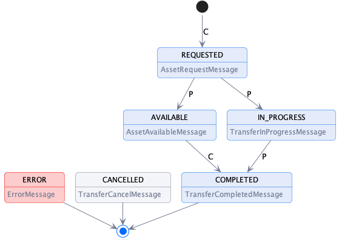

# Transfer Process Protocol

## Introduction: Terms

This document outlines the key elements of the transfer process protocol. The following terms are used:

- A _**message type**_ defines the structure of a _message_.
- A _**message**_  is an instantiation of a _message type_.
- The _**transfer process protocol**_ is the set of allowable message type sequences and is defined as a state machine (TP-SM).
- A _**transfer process (TP)**_ is an instantiation of the CNP-TP.
- A _**provider**_ is a participant agent that offers an asset.
- A _**consumer**_ is a participant agent that requests access to an offered asset.
- A _**Connector**_ is a `PariticipantAgent` that produces `Agreements` and manages `Asset` sharing.
- An _**Asset**_ is data or a service a provider grants access to.
- An _**Agreement**_ is a result of a [Contract Negotiation](../negotiation/contract.negotiation.protocol.md) and is associated with _exactly one_ `Asset`.

## Transfer Process  Protocol

A transfer process (TP) involves two parties, a _provider_ that offers one or more assets under a usage policy and _consumer_ that requests assets. A TP progresses through
a series of states, which are tracked by the provider and consumer using messages. A TP transitions to a state in response to a message from the counter-party.

### Connector Components: Control and Data Planes

A TP is managed by a `Connector`. The connector consists of two logical components, a `Control Plane` and a `Data Plane`. The control plane serves as a coordinating layer that
receives counter-party messages and manages the TP state. The data plane performs the actual transfer of asset data using a wire protocol. Both participants run control and data
planes.

It is important to note that the control and data planes are logical constructs. Implementations may choose to deploy both components within a single process or across
heterogeneous
clusters.

### Asset Transfer Types

Asset transfers are characterized as `push` or `pull` transfers and asset data is either `finite` or `non-finite`. This section describes the difference between these types.

#### Push Transfer

A push transfer is when the producer data plane initiates sending of asset data to a consumer endpoint. For example, after the consumer has issued an `AssetRequestMessage,` the
producer begins data transmission to an endpoint specified by the consumer using an agreed-upon wire protocol.

<< Include example diagram >>

#### Pull Transfer

A pull transfer is when the consumer data plane initiates retrieval of asset data from a producer endpoint. For example, after the consumer has issued an `AssetAvailableMessage,`
the consumer requests the data from the producer-specified endpoint.

<< Include example diagram >>

#### Finite and Non-Finite Asset Data

Asset data may be `finite` or `non-finite.` Finite data is data that is defined by a finite set, for example, machine learning data or images . After finite data transmission has
finished, the transfer process is completed. Non-finite data is data that is defined by an infinite set or has no specified end, for example streams or an API endpoint. With
non-finite data, a TP will continue indefinitely until either the consumer or provider explicitly terminates the transmission.

### Transfer Process States

The TP states are:

- **REQUESTED** - An asset has been requested under an `Agreement` by the consumer and the provider has sent an ACK response.
- **AVAILABLE** -
- **IN_PROGRESS** -
- **COMPLETED** -
- **CANCELLED** -
- **ERROR** - The provider or consumer has placed the transfer process in an error state. This is a terminal state.

### Transfer Process State Machine

## Message Types

### AssetRequestMessage

- Request distribution, media type

### AssetAvailableMessage

### TransferInProgressMessage

### TransferCompletedMessage

### ErrorMessage

### TransferCancelMessage
